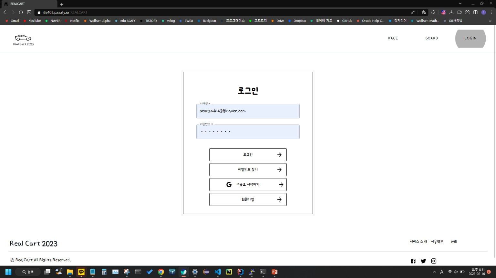
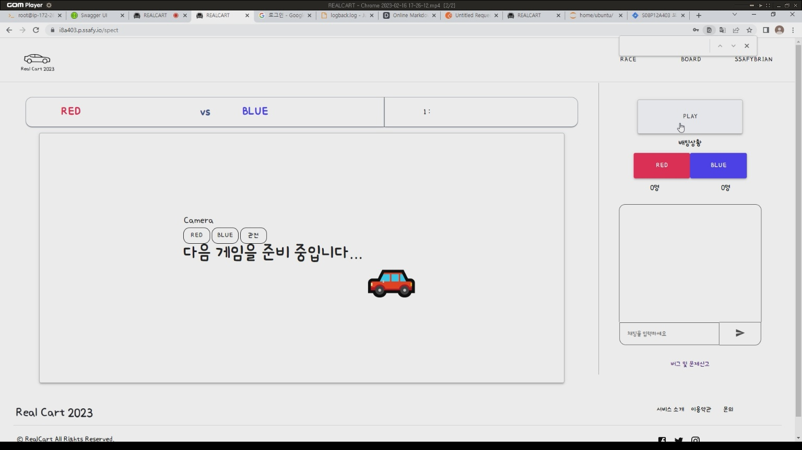
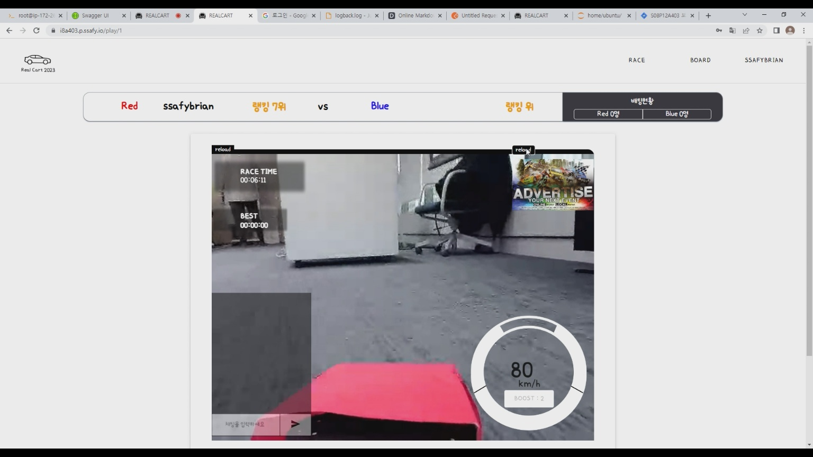
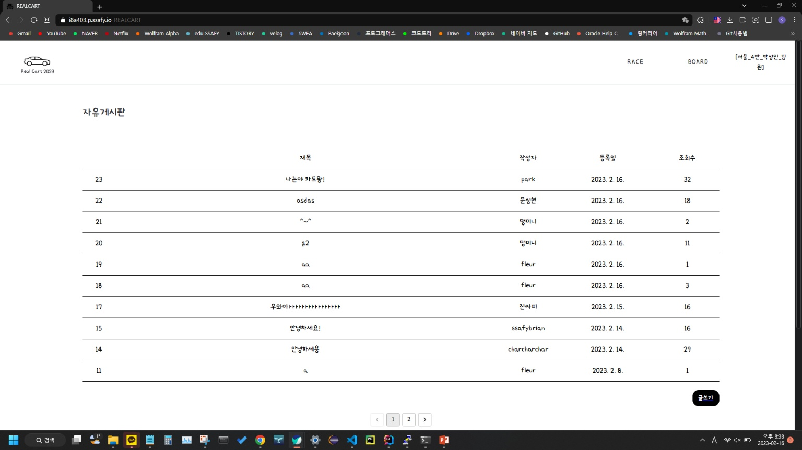
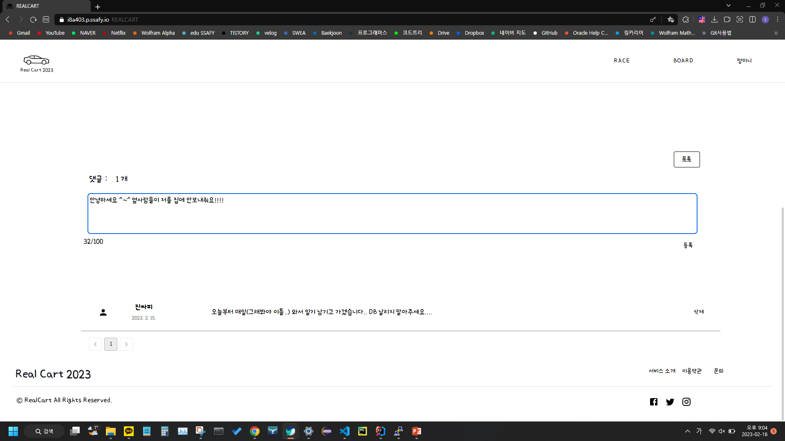
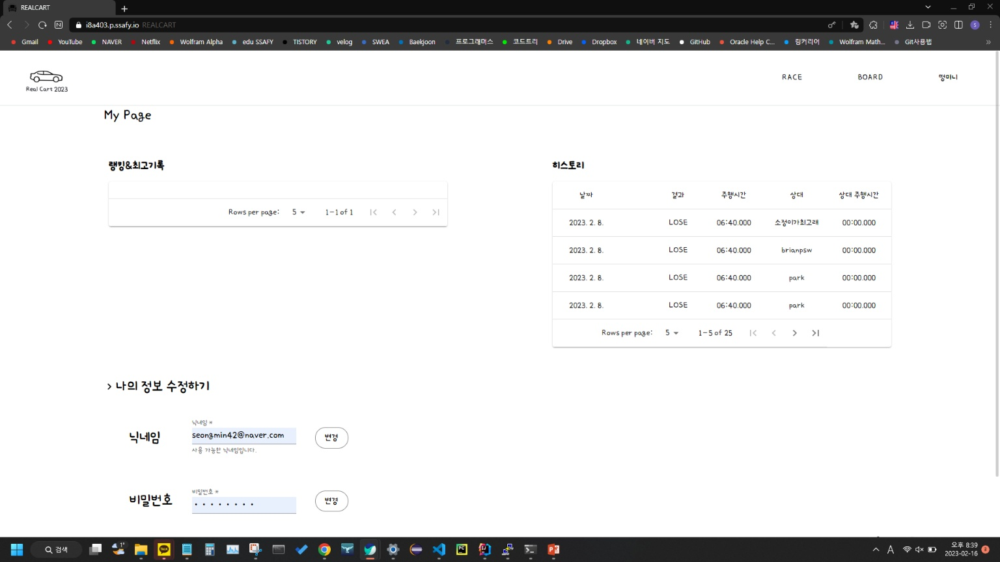
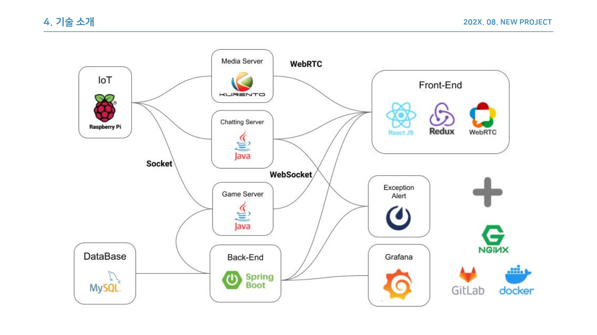

## 🚗 RealCart - 실시간 RC카 웹게임

## :video_game: 프로젝트 진행 기간

2022.12.27(화) ~ 2022.02.17(금) (52일간 진행)  
SSAFY 8기 2학기 공통프로젝트 - RealCart

## 	🚩RealCart - 배경

여러분은 RC카에 대해 얼마나 관심을 갖고 계신가요? 영화나 광고에서 RC카를 멋지게 조종하는 모습을 보고 흥미를 느꼈지만 높은 비용과 카트 보관, 그리고 제한적인 공간에 번거로움을 느껴 포기하시지는 않았었나요? REAL CART는 여러분을 위해 RC카를 체험하기 위한 간편한 환경을 제공합니다!

REAL CART는 웹을 통해 간편하게 RC카를 이용한 경주를 체험할 수 있도록
만들어진 웹 기반 게임 서비스입니다. REAL CART와 함께 어린 시절의 추억과 RC카 조종의 즐거움을 느껴보세요!

## :video_game: RealCart - 개요

REAL CART는 웹을 통해서 실제 카트를 현실처럼 체험해보자는 뜻에서 만들어진 이름입니다.
REAL CART에서는 현재 진행되는 게임을 관전하거나 직접 참여하기 위해 대기열에 참여할 수 있습니다.
앞선 대기자들의 경기가 끝나면 게임 룸에 입장하여 REAL CART가 준비한 트랙 위에서 실제 카메라 화면을 보며 키보드 조작을 통해 경주할 수 있습니다.
RC카에 달린 카메라가 웹 페이지에 영상을 전달해 직접 RC카를 타고 달리는 느낌을 전달합니다.

REAL CART를 통해 사용자들은 쉬운 접근성으로 RC카 레이싱을 간편하게 즐길 수 있고, 플레이 중에도 다른 유저들과 채팅 및 배팅 기능을 통해 소통할 수 있습니다. 무엇보다도 정해진 트랙과 인게임 규칙을 통해 실제 RC카로도 쉽게 경험할 수 없는 경쟁의 재미를 느낄 수 있습니다.

## 	🚩주요 기능

---

- ### 로그인 화면
  

  
  - 게임 참가를 원하는 예비유저들은 회원가입과 일반로그인,소셜로그인을 할 수 있습니다.
    
- ### 관전 화면
  
  
  - 게임을 원하는 유저는 "입장" 버튼을 눌러 대기열에 등록할 수 있습니다.
  - 채팅을 통해 관전 중인 다른 사람들과 게임을 즐길 수 있습니다.
  - 배팅 버튼을 통해 현재 플레이 중인 유저들을 응원할 수 있습니다.
  - 현재 진행중인 플레이어의 랭킹 정보를 볼 수 있습니다.
  - 본인 순서에도 일정 시간 이상 입장하지 않은 유저는 대기열에서 제외됩니다.
- ### 게임 화면
  
  
  
  화살표 키입력을 통해 게임을 즐길 수 있습니다.
  - 부스터와 급정지 기능도 제공합니다.
  - 쉬운 조작을 위해 게임 화면에 도우미 화면을 띄워줍니다.
  - 관전 화면에 있는 유저들과 채팅이 가능합니다.
  - 게임이 끝나면 관전 페이지 혹은 마이 페이지로 이동시켜줍니다.
  - 중도에 브라우저를 끄거나 비정상 종료 시 기권처리됩니다.
- ### 게시글
  
  
  게임을 즐기는 유저들의 자유 글을 볼 수 있는 게시판입니다.
  
  - 원하는 게시글에 댓글을 달 수 있습니다.
  
  - 문의사항이 있으면 관리자와 소통할 수 있습니다.
  - 공지사항을 볼 수 있습니다.
- ### 마이페이지
  
  
  
  - 내 경기 기록 랭킹과 히스토리 열람이 가능합니다.
  - 닉네임과 패스워드 변경이 가능합니다.

## 	🚩주요 기술

---

## 🙆 협업 툴

---

- Git
- Notion
- JIRA
- MatterMost
- Webex

## 🙆 협업 환경

---

- Gitlab
  - 코드 버전 관리
  - Jira와 연동하여 일정 관리
  - 커밋 컨벤션 준수
- JIRA
  - 매주 일정에 따른 업무를 할당하여 Sprint 진행
  - JIRA 컨벤션 준수
- 회의
  - 아침마다 스크럼 회의 진행
  - 주별로 전 파트 코드리뷰 진행
  - 그라운드 룰 준수
- Notion
  - 각종 문서 아카이빙과 회의록 보관
  - 기능명세서, 이해관계자, 유즈케이스 시나리오 등 문서 보관
  - 코딩 컨벤션 정리
  - 프로젝트 일정 정리
  - 그라운드 룰 명시

## 🙆  팀원 역할 분배

---

## 	🚩 프로젝트 산출물

---

- [기능명세서](https://lab.ssafy.com/s08-webmobile3-sub2/S08P12A403/-/blob/master/docs/%EA%B8%B0%EB%8A%A5%EB%AA%85%EC%84%B8%EC%84%9C.png)
- [이해관계자 파악 및 분석](https://lab.ssafy.com/s08-webmobile3-sub2/S08P12A403/-/blob/master/docs/%EC%9D%B4%ED%95%B4%EA%B4%80%EB%A6%AC%EC%9E%90%ED%8C%8C%EC%95%85%EB%B0%8F%EB%B6%84%EC%84%9D.png)
- [Swagger UI](https://lab.ssafy.com/s08-webmobile3-sub2/S08P12A403/-/blob/master/docs/SwaggerUI.png)
- [페르소나](https://lab.ssafy.com/s08-webmobile3-sub2/S08P12A403/-/blob/master/docs/%ED%8E%98%EB%A5%B4%EC%86%8C%EB%82%98.png)
- [ERD](https://lab.ssafy.com/s08-webmobile3-sub2/S08P12A403/-/blob/master/docs/ERD.png)
- [Usecase 다이어그램](https://lab.ssafy.com/s08-webmobile3-sub2/S08P12A403/-/blob/master/docs/UseCaseDiagram.png)
- [Usecase Scenario](https://lab.ssafy.com/s08-webmobile3-sub2/S08P12A403/-/blob/master/docs/UsecaseScenario.pdf)

## 	🚩: 프로젝트 결과물

---

- [포팅메뉴얼](https://lab.ssafy.com/s08-webmobile3-sub2/S08P12A403/-/blob/master/exec/Porting%20Manual.md)
- [중간발표](https://lab.ssafy.com/s08-webmobile3-sub2/S08P12A403/-/blob/master/docs/ppt/A403%20%EC%A4%91%EA%B0%84%EB%B0%9C%ED%91%9C.pdf)
- [최종발표](https://lab.ssafy.com/s08-webmobile3-sub2/S08P12A403/-/blob/master/docs/ppt/%EC%B5%9C%EC%A2%85%EB%B0%9C%ED%91%9C.pdf)

## Feature List

[Notion을 통해 기능 명세서 보기](https://www.notion.so/de1148f40e74493783cc73845632d09b?v=8046b25805fd4c47a241250a2f666c6f)

## Story Board

[Figma를 통해 스토리 보드 보기](https://www.figma.com/file/1CsDSrPjOCgIbFrGzz7rXX/SSAFY-%EA%B3%B5%ED%86%B5-PJT?node-id=0%3A1&t=x31VtcYOxlJEJpVD-0)

## IoT 부품 리스트

[Notion을 통해 부품 리스트 확인](https://www.notion.so/fa3c1da26ae44478a8a88b7f401fdb9d)
