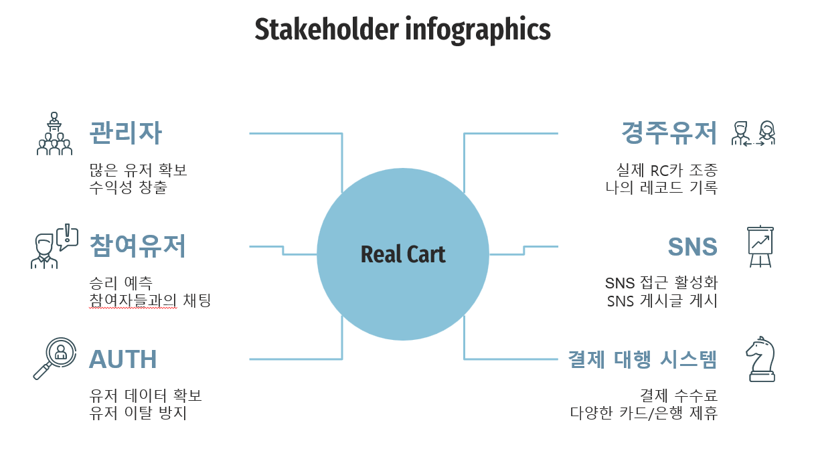

## 1. 관리자

| OBJECTIVES | NEEDS |
| --- | --- |
|• 유저 확보|• 주행 전 장비 상태 테스트 기능|
|• 과금을 통한 수익성 증대|• 1대1 상담(챗봇)|
|• 원활한 게임 유저 순환|• 버그 신고 접수 채널|
|• 게임 버그 또는 문제 발생 시 신속한 처리|• 유저 밴 기능|
|• 악성 유저 관리|• 게시글 수정/삭제 권한|
|• 게시글 관리|• 캐시 아이템|
|• 유지/보수 비용 최소화||
|• 유저와의 소통||

## 2. 경주유저

| OBJECTIVES | NEEDS |
| --- | --- |
| • 실제 RC카 조종                            | • 간단하고 편리한 UI/UX                   |
| • 컴퓨터 그래픽이 아닌 실제 운전 같은 경험   | • RC카 카메라를 통한 실제 경주 화면 제공 |
| • 나의 레코드 기록                         | • 레코드 랭킹 제도 |
| • 나의 베스트 레코드 자랑                   | • 친구 추가 |
| • 주변 사람들과 경주 레이싱                 | • SNS 연동하여 레코드 공유 |
| • 주행 중 나의 감정표현                     | • 경쟁 레이싱 모드 |
| • 오류 및 문제 신고                        | • 타임어택 모드 |
| • 게임 매칭 또는 상황 알림                 | • 매끄러운 화면 송출 |
|                 | • 튜토리얼 |
|                  | • 나의 레코드 히스토리/분석 |
|                | • 이모티콘 기능 |
|                | • 오류 및 문제 신고 기능 |
|                | • 알림 기능 |

## 3. 참여유저

| OBJECTIVES | NEEDS |
| --- | --- |
| • 승리 예측/응원 티어 향상 | • 응원 점수 제도(특별 보상) |
| • 상대팀 견제 | • 견제 아이템 사용 |
| • 참여자들과의 채팅 | • 실시간 채팅 기능 |
| • 오류 및 문제 신고 | • 비속어 필터 기능 |
| • 게임 매칭 또는 상황 알림 | • 오류 및 문제 신고 기능 |
|  | • 알림 기능 |

## 4. SNS

| OBJECTIVES | NEEDS |
| --- | --- |
| • 기업 홍보 | • 간편한 SNS 공유 기능 |
| • 유저 확보 | • 댓글/해시태그 유도 |
| • 게시글 확보 | • 자동 게시글 작성 |
| --- | • 게임 커뮤니티 기능 |

## 5. AUTH(구글, 네이버 계정 연동)

| OBJECTIVES | NEEDS |
| --- | --- |
| • 유저 데이터 확보 | • 유저 관심사 바탕으로 광고 게시 |
| • 유저 이탈 방지 | • 소셜 로그인 |

## 6. 결제 대행 시스템(PG)

| OBJECTIVES | NEEDS |
| --- | --- |
| • 결제 수수료 | • 결제 대행 시스템 제공 |
| • 다양한 카드/은행사 제휴 | • 간편 결제 기능 |
|  | • 다양한 카드/은행 수단 제공 |
